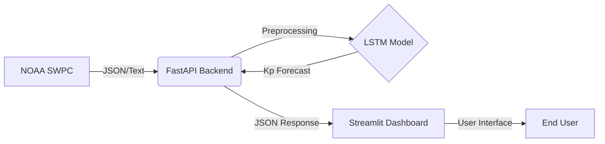
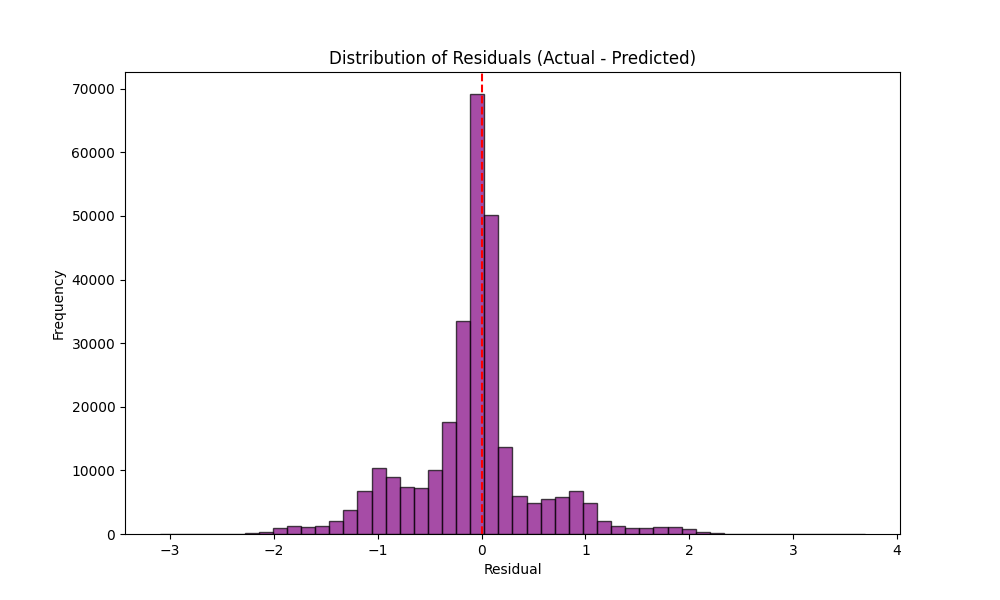

# AuroraNet
### Deep Learning Aurora Forecast & Visualization System


## Overview
**AuroraNet** is a capstone portfolio project designed to predict the likelihood of aurora borealis sightings using deep learning. By analyzing real-time solar wind data and geomagnetic indices, AuroraNet provides accurate, localized forecasts for aurora hunters and space weather enthusiasts.

The system consists of a **FastAPI** inference engine that processes live NOAA data and a **Streamlit** dashboard that visualizes the auroral oval and visibility probabilities on an interactive map.


---

## Key Features

### Advanced Forecasting Model
- **LSTM Architecture**: Utilizes Long Short-Term Memory (LSTM) networks to capture temporal dependencies in solar wind speed, density, and magnetic field data, along with previous Kp data.
- **Feature Engineering**: Implements cyclical time encoding (sine/cosine for hour/day) and moving averages to smooth sensor noise (`src/data/feature_engineering.py`).
- **Real-time Inference**: Fetches live solar wind data from NOAA SWPC, processes it, and generates Kp index forecasts for the next 2 hours.

### Interactive Dashboard
- **Auroral Oval Map**: Visualizes the dynamic boundary of the aurora on a Folium map based on predicted Kp levels.
- **Location-Based Alerts**: Calculates visibility probability ("Low", "Possible", "Good", "Very High") for key locations like Seattle, Reykjavik, and Tromsø.
- **Timeline Slider**: Allows users to scrub through the forecast timeline to see how conditions evolve.

### Robust Engineering
- **Microservices Architecture**: Decoupled inference API and frontend dashboard for scalability.
- **Caching Strategy**: Implements in-memory caching to minimize load on external NOAA APIs and reduce latency.
- **Automated Pipeline**: End-to-end script (`src/build_dataset.py`) for fetching historical OMNI data, cleaning, scaling, and creating supervised learning sequences.

---

## System Architecture

The project follows a containerized microservices pattern:

1.  **Data Ingestion**: The API service fetches real-time solar wind data (Speed, Density, Bz) and recent Kp indices from NOAA.
2.  **Preprocessing**: Data is cleaned, merged, and transformed using the same scaler fitted during training.
3.  **Inference Service (FastAPI)**: A PyTorch model predicts future Kp values.
4.  **Frontend (Streamlit)**: Consumes the API to render visualizations and metrics.



---

## Experimentation & Tuning

### Hyperparameter Sweeps with Weights & Biases
To optimize the model's performance, we conducted extensive hyperparameter sweeps using **Weights & Biases (W&B)**. We explored the following search space:
- **Number of Layers**: [1, 2, 3]
- **Hidden Dimensions**: [32, 64, 128, 256]
- **Learning Rate**: Log-uniform distribution between 1e-4 and 1e-2
- **Dropout**: 0.0 to 0.5
- **Batch Size**: [32, 64, 128]

**Result**: The final model uses a sequence length of 72 timesteps with 64 hidden units, achieving the lowest RMSE and most stable learning on the validation set.



### Testing Strategy
- **Unit Tests**: Validation of feature engineering functions (e.g., ensuring cyclical features remain between -1 and 1).
- **Integration Tests**: Checking the `/health` and `/predict` endpoints of the API.
- **Data Validation**: Runtime checks to ensure fetched NOAA data is not empty or stale before passing it to the model.

---

## Installation & Usage

### Prerequisites
- Docker & Docker Compose
- Python 3.10+ (for local development)

### Running with Docker (Recommended)
```bash
# Clone the repository
git clone https://github.com/yourusername/AuroraNet.git
cd AuroraNet

# Create the .env file from the template
cp .env.example .env

# Open the new .env file and replace the placeholder text with your actual WandB API key.

# Build and run services
docker-compose up --build
```
- **API**: http://localhost:8000
- **Dashboard**: http://localhost:8501

### Local Development
1. **Install Dependencies**:
   ```bash
    pip install -r requirements.txt -r requirements_dashboard.txt
   ```
2. **Run API**:
   ```bash
   uvicorn app:app --reload
   ```
3. **Run Dashboard**:
   ```bash
   streamlit run dashboard.py
   ```

---

## Project Structure

```text
AuroraNet/
├── app.py                      # FastAPI entry point
├── dashboard.py                # Streamlit frontend
├── Dockerfile                  # API Docker image
├── Dockerfile.dashboard        # Dashboard Docker image
├── requirements.txt            # API dependencies
├── requirements_dashboard.txt  # Dashboard dependencies
├── docker-compose.yml          # Docker Compose configuration
├── EDA.ipynb                   # Exploratory Data Analysis
├── README.md                   # Project description
├── src/
│   ├── build_dataset.py        # Data pipeline script
│   ├── data/                   # Data fetching & processing modules
│   │   └── feature_engineering.py
│   └── models/                 # Model definition & inference logic
│       └── lstm.py
├── tests/                      # Unit & integration tests
├── results/                    # Plots and saved metrics
└── artifacts/                  # Saved models and scalers
```

---

## Future Improvements
- **Transformer Model**: Experimenting with Temporal Fusion Transformers (TFT) for better long-term horizon accuracy.
- **User Accounts**: Adding alert subscriptions via email/SMS for high-activity events.
- **Cloud Deployment**: Deploying the containerized stack to AWS ECS or Google Cloud Run.

---

*Developed by Shaan Patel as a Capstone Project.*
